# Getting started with Anaconda Navigator

[Anaconda](https://en.wikipedia.org/wiki/Anaconda_(Python_distribution)) itself is an [freemium](https://en.wikipedia.org/wiki/Freemium) distribution of Python. It aims to make package management and deployment easier. Anaconda provides `conda`, a package management system.

[Anaconda Navigator](https://docs.anaconda.com/free/navigator/) is a graphical interface for launching common Python programs without having to use command lines, to install packages and manage your environments. It also allows you to launch applications and easily manage conda packages, environments, and channels without using command-line commands.

## Updating the `'ol-connectome'` environment based on the 'requirements.txt' file.  

Below is a step-by-step run through, with screenshots, of how to update your `'ol-connectome'` environment based on the ['requirements.txt'](https://github.com/reiserlab/optic-lobe-connectome/blob/main/requirements.txt) file in the main ['optic-lobe-connectome'](https://github.com/reiserlab/optic-lobe-connectome/) folder (this should already have been created as explained in the [python-getting-started page](python-editors-getting-started.md#Createthe_ol-connectome_environment)). If you are using Microsoft Windows, you might need to take an [extra step to install the C++ build tools](python-getting-started.md#extra-step-for-windows).

## Open the 'Anaconda Navigator' and look at the available environments

Once you have opened Anaconda Navigator you will need to click on the `'Environments'` tab on the far left columnn. This will then display your available environmets in the second column. In the screenshot below you can see that in this case there are three available environments: `'base'`, `'ol-connectome'` and `'pandas-playground'`.

 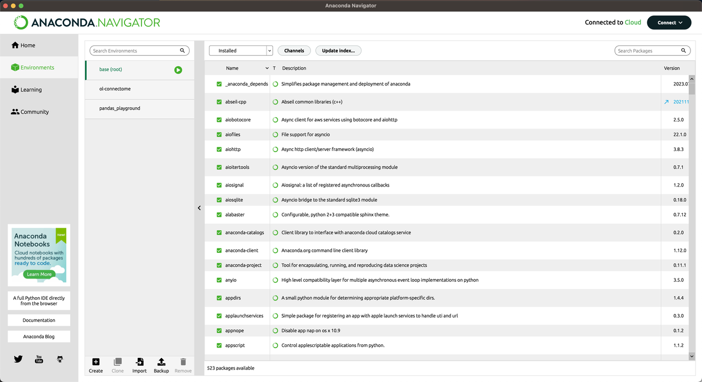

## Renaming the current 'ol-connectome' environment. 

Although you can overwrite the current `'ol-connectome'` environment directly based on the dependencies described in the ['requirements.txt'](https://github.com/reiserlab/optic-lobe-connectome/blob/main/requirements.txt) file, it is safer to simply generate a new environment with these dependencies. To do this, we must first rename the current `'ol-connectome'` environment so that we might name the new, updated environment `'ol-connectome'`. Keeping the name ensures consistency when running other people's code. 

To do this, open an environment that is not `'ol-connectome'`, i.e. the `'base'` environment in a terminal window by clicking on the green arrow to the side and choosing `'Open Terminal'`. You cannot rename an environment if it is currently active, if you are in the `'ol-connectome'` environment decactivate it by typing `'conda deactivate'` in a terminal where you have that environment currently activated. 

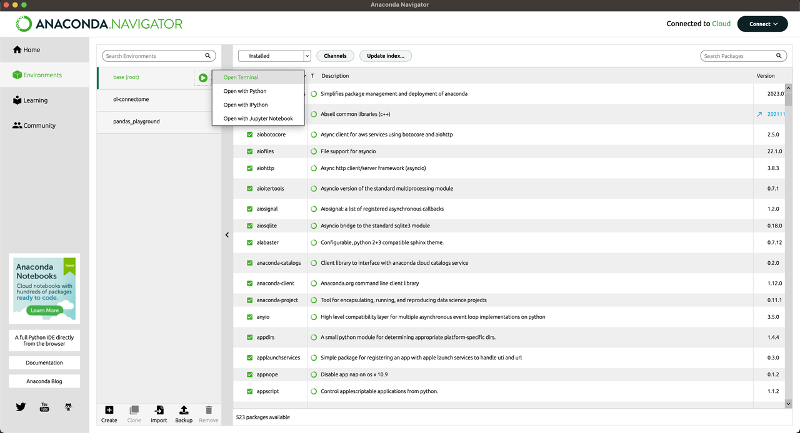

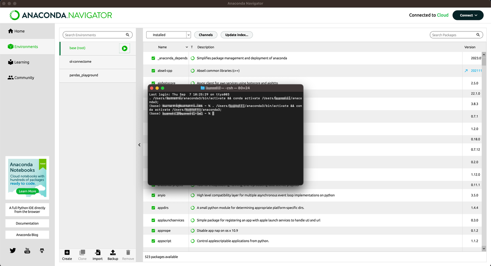

Once you have a terminal window open, where you can see you are in the env `(base)` you can then type: 

```sh
conda rename -n current_env_name new_env_name`
```

Which in my case was: 

```sh
conda rename -n ol-connectome ol-connectome-230907`
```

I am using a naming structure that appends the date of which I create the 'new' environment to the old one. I.e. the date when the old environment was last used in a YYMMDD format, but you could use any naming structure. 

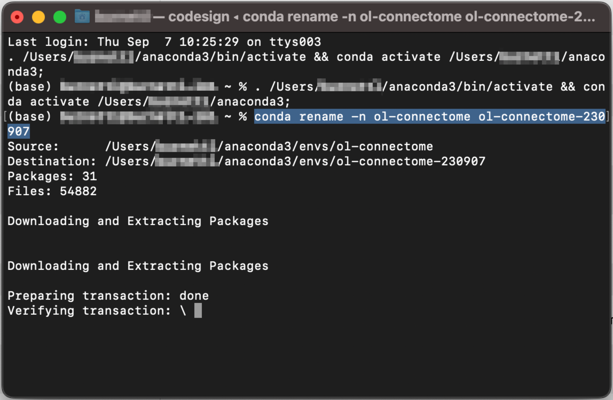

Once the environment has been renamed it should be updated automatically in Anaconda Navigator. 

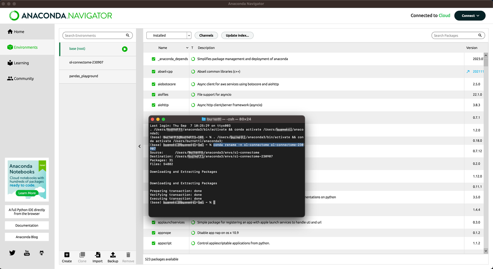


## Generating a new environment based on the requirements in the `'requirements.txt'` file

You can now click on the `'Import'` button – found at the bottom of the second column of the navigator interface.

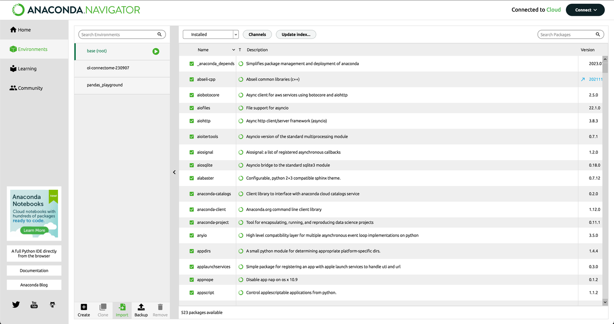

When the pop-up window appears choose the top option: `'Local Drive'` and click on the small folder icon to the right.

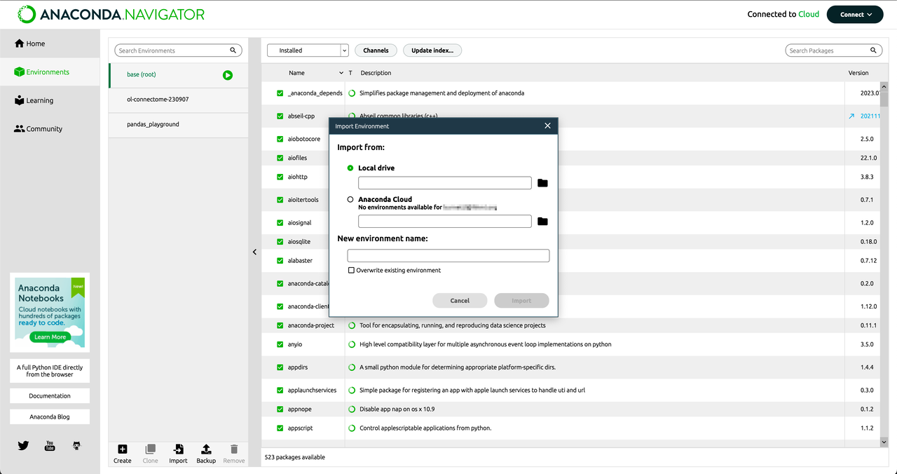

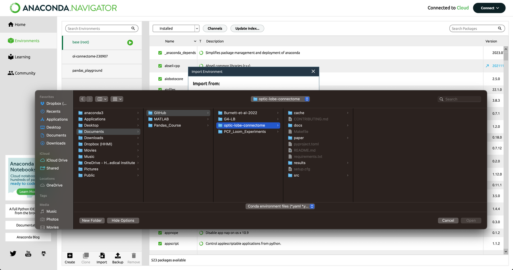

Locate the 'optic-lobe-connectome' folder that might be found in your Github folder or [wherever you cloned your repository](git-getting-started.md#cloning) at.

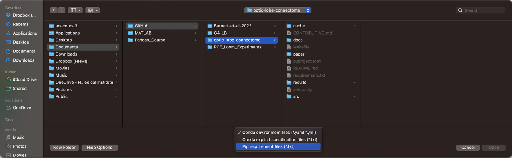

Select `'pip requirement files (*.txt)'` from the drop-down box to be able to select the `'requirements.txt'` file from within the `'optic-lobe-connectome'` folder. Click `'open'`. 

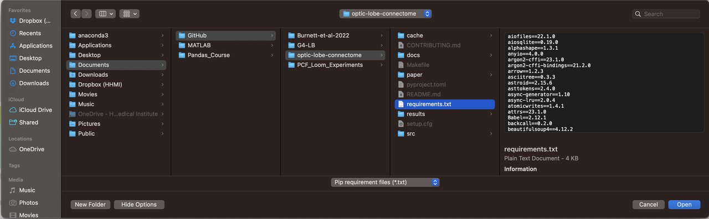

You will then be taken back to the pop-up window – make sure the 'New environment name:' is `ol-connectome`, then click `'Import'`. 

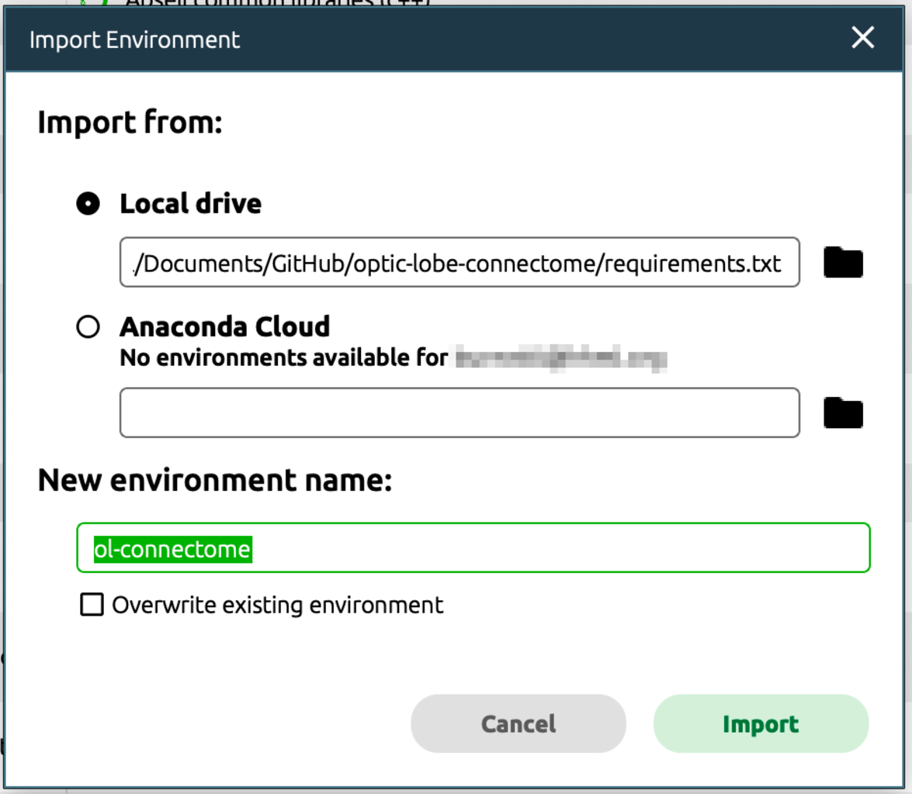

While the navigator is importing the new packages into this environment it will look like this: 

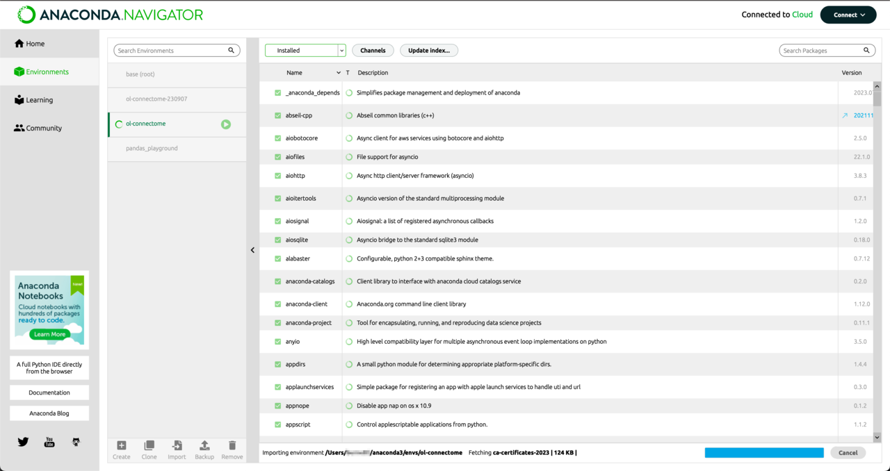

Once the updated environment is ready you will see it added to your list of available environments in the second column. 

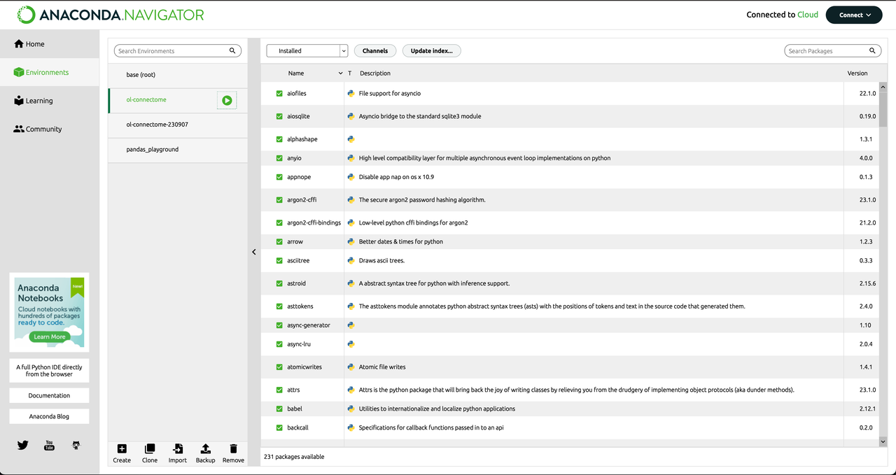
