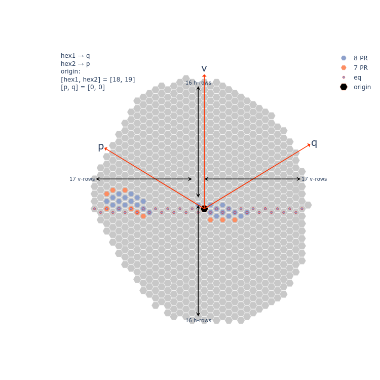

# Coordinate systems

## X Y Z

Data from neuprint uses x y z coordinates. Here is a place to describe that coordinate system.

## Hex1 Hex2

Omatidia in the _Drosophila_ compound eye are arranged in what resembles a hexagonal grid. Each individual 
omatidia can be uniqueliy identified along the 3 hexagonal axis hex1, hex2, and hex3. In fact, any two of
these coordinates is enough to identify the location. The hex1 hex2 coordinates used in the neuprint database
and in our analysis are positive numbers. The origin of the coordinate system is arbitrarily located outside
of the eyemap.

## P Q V

A biologically more relevant coordinate system uses the center of the eye as the origin of the P and Q coordinate
system. We define the hex1 hex2 coordintes [18 19] as our origin for P Q.

The H and V-axis use the same origin with V representing the virtual hex3. The H axis is somewhat parallel to the
perceived horizon.

A pdf (with vector graphics) [is available here](assets/column_coord.pdf).