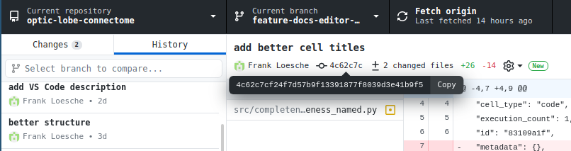
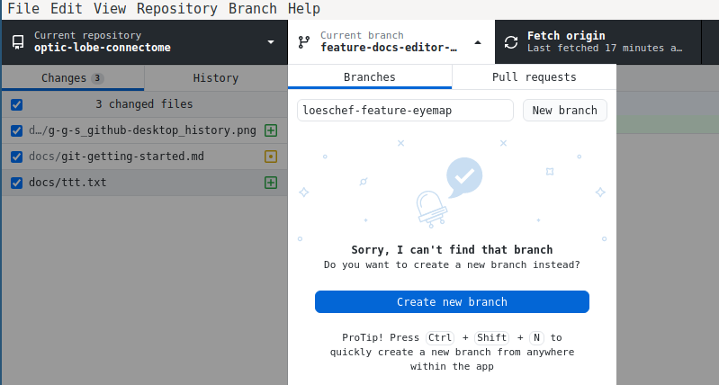
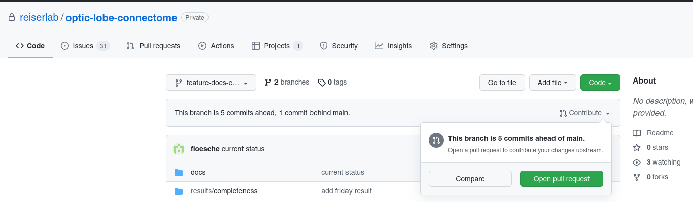

# Getting started with Git and GitHub

For this project, I suggest to use a [feature branch workflow](https://www.atlassian.com/git/tutorials/comparing-workflows/feature-branch-workflow) in git. Furthermore I recommend to do the merge with the `main` branch through pull requests on GitHub at least once a week and have someone else accept requests.

Feel free to skip the rest of the document if the above information makes sense and you agree with it. In the following sections I will describe how to work with git and GitHub in more detail and provide some reasoning for the suggested workflow model.

## What is git, a git client, and GitHub?

Git is a software that allows to keep track of different versions of source code in the same directory. This type of software is called _source code management_ software (SCM). Imagine, you have a set of scripts that work well and that you use every once in a while, but you want to test a new idea for a data analysis. Without SCM you would probably create a new directory, copy all the files there, and  start developing the new version there. With `git` you can stay in the same directory and use `git branch` to switch between different versions. Similarly, if you know that your script worked six months ago but doesn't work right now, `git log` would allow you to have a look at what changed since then and recover this earlier version. While git is already useful for a single person, it was designed as a tool to collaborative develop millions of lines of code between thousands of individuals. Since then it has been used for a large variety of different use cases.

At its core, [`git`](https://git-scm.com/) is a command line tool to keep the different versions of code organized and is the most powerful and complete client software to interact with the files. In addition, there is a variety of graphical user interfaces (GUIs) to make `git` more accessible. In my initial email I had asked about your git experience and preferences. Back then, a few responded that they had used the software [GitHub Desktop](https://desktop.github.com/). If you don't have another preference, I would suggest that you install this free git client from the website -- it is available for Linux, MacOS and Windows. The rest of the documentation will use GitHub Desktop and `git` for the examples. Please note, that the client GitHub Desktop (a git client) is something completely different from GitHub (the website hosting git repositories) -- but yes, the shared name has lead to confusion in the past…

[GitHub](https://github.com) is a webservice where people can host their git projects. Once you share a git repository on GitHub, you can use the website to look at the content of the directory, switch between different branches, and have some other basic interactions with the files in git. In addition, GitHub provides some project management for the git repositories. Most notably you can open and track issues (and other code review and bug tracking tools), run tests and verifications on your code (so called Continuous Integration and Continuous Delivery, CI/CD features), and use boards that are inspired from Kanban to manage long-time goals. All of theses additional features are well integrated with the code. GitHub is just one, although probably the most well-known webhoster for git repositories. For this project, we will use a subset of GitHub's features to manage the project and code.

Other notable examples for git webhosters are [GitLab](https://en.wikipedia.org/wiki/GitLab), [Gitea](https://en.wikipedia.org/wiki/Gitea), [Bitbucket](https://en.wikipedia.org/wiki/Bitbucket), [GNU Savannah](https://en.wikipedia.org/wiki/GNU_Savannah), and [SourceForge](https://en.wikipedia.org/wiki/SourceForge) -- some of these services also support other SCM systems like [Mercurial](https://en.wikipedia.org/wiki/Mercurial) or [Subversion](https://en.wikipedia.org/wiki/Apache_Subversion).

## `git` terminology

Across `git`, any git client like GitHub Desktop, and git webhosters like GitHub, there is a shared terminology. Here a brief list with some comment on the relevance for our project. There is an excellent [free book available on the git website](https://git-scm.com/book) and here we will only touch on some parts from chapters 2 and 3, but if you have questions or want to read more, this book is always a good reference.

### Initialization

If you want to convert a normal directory into a git repository, you will need to initialize the project. This can be done by navigating to the directory of your project and then type `git init`. In GitHub Desktop you can achieve the same with _File_ → _New Repository_. For this current project you don't have to do this, the project has already been initialized.

### Cloning

Instead of creating a new git project, you can also `git clone` a project. This means you pull an existing git project from a remote webhoster, for example from GitHub. If you got to the repository at <https://github.com/reiserlab/optic-lobe-connectome>, you will see a green _Code_ button. A click will give you the URL for cloning the code. You can either use it on the CLI by typing `git clone git@github.com:reiserlab/optic-lobe-connectome.git` or you can use the URL in the GitHub Desktop client by clicking _File_ → _Clone repository_ → _URL_. This will create a copy of the project locally on your computer, at whatever location you choose.

### Adding files

Any file from inside the directory that you want to add to the git repository needs to be added. The same applies to files that are part of the repository but that you have changed, for example in an [editor](python-editors-getting-started.md). Adding files in _git lingo_ only means that the changes done to the files are considered to be part of the repository, although at this point they are not yet part of the history. Adding files means that they are going to be part of your next commit, but except adding them to the list of candidates for the commit, nothing much happens when adding a file. You can make changes to files and then not add them -- which means they will not be committed. On the CLI you can type `git add <FILENAME>` or `git add -A` if you want to add all files. In GitHub Desktop new files in the directory are automatically added.

### Committing files

Once you have done a set of changes to your files and added them, you can _save_ these changes to the git repository with `git commit` on the CLI. You will be asked to give a summary and a short description of the changes. In GitHub Desktop, you can enter a summary on the left bottom side of the window, add a short description, and then click the _Commit to…_ button. After committing, the set of changes has become part of the local history. Each commit is identified by a unique _hash_.

### Look at the history

Each time you commit files, they become part of the currently active branch. You can look at the history of commits to this branch by typing `git log` and you will see the _hash_ for each commit along with who authored it, the date, and a description of changes. In the GitHub Desktop client you can see the history when you click on the _History_ tab on the left pane in the GitHub Desktop client.

### Push and Pull

Most interactions with git like `git add`, `git commit`, or branching are done locally on your computer. If you want to interact with the shared project on GitHub, `git pull` gets the newest changes from the website and copies it to your local system. `git push` does it the other way: your local changes are sent to the webhoster. In the GitHub Desktop client this is easily done through the _Fetch Origin_ button or through the menu _Repository_ → _Pull_ and _Repository_ → _Push_.

### Branches

Branches are basically different versions of a directory. By default, the standard branch in a project is called `main`. There is no limit on the number of branches, for example every developer can have a branch they are working on, or specific features can have their own branch during development. Branches branch off any other branch at a specific commit. Any branch can have any set of sub-branches. Following the [feature branch workflow](https://www.atlassian.com/git/tutorials/comparing-workflows/feature-branch-workflow), the development of new code should always happen on a branch other than `main`. You can create a new branch called `loeschef-feature-eyemap` with `git checkout -b loeschef-feature-eyemap` or either by clicking on the arrow next to the _Current branch_ or selecting _Branch_ → _New Branch_ from the menu in GitHub Desktop.

### Merging branches

After a split, any of the branches can have any number of changes to the source code. The process of getting all these changes back together into a single branch is called merging. Following the [feature branch workflow](https://www.atlassian.com/git/tutorials/comparing-workflows/feature-branch-workflow), we will use the _Pull requests_ on the GitHub website for merging branches into the `main` branch. Once you think your code is ready for the `main` branch, push it to the GitHub website. Once it is there, you can select your branch and then click on the _Contribute_ button and select _Open pull request_. The previous descriptions from your commits should already explain most of the changes, but you could summarize what you did in the title and description of the pull request. Then click on _Create pull request_. Someone else will then take care of the actual merge into `main`. By letting someone else do the merge, we automatically have a _four eyes principle_ in place that will increase the code quality and reduce workload towards the end of the project.

