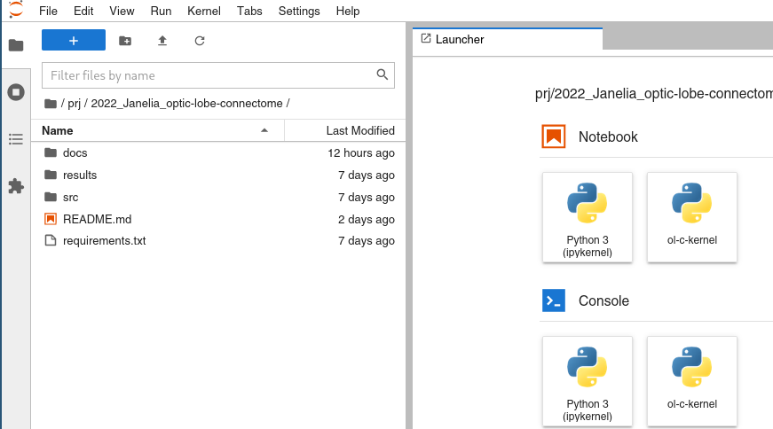
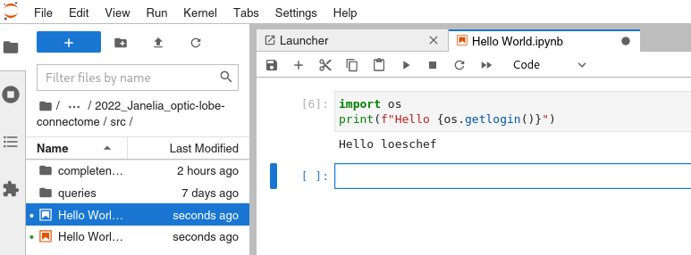

# Editing Python files

Any text editor can be used to edit Python files.

While the documentation could have ended after the previous sentence, here some ideas that make editing easier. This is not intended to start another [holy war](https://en.wikipedia.org/wiki/Editor_war) but rather explain my personal setup and help the undecided to navigate their own choices. My setup uses the workflow of [literate programming](https://en.wikipedia.org/wiki/Literate_programming), a technique where normal text and code blocks are interweaved (eg [Jupyter notebooks](https://docs.jupyter.org), [R markdown](https://bookdown.org/yihui/rmarkdown/), or [MATLAB Live Script](https://www.mathworks.com/help/matlab/matlab_prog/what-is-a-live-script-or-function.html)). But first, lets have a look at the file types and file structure in the project.

## File types

The python code in this repository comes in two different file formats: either as a `*.py` Python script or a `*.ipynb` Jupyter Notebook (formerly called iPython Notebook). At the file format level, the difference is that the `*.py` file is a text file that can be parsed line by line. The `*.ipynb` are [JSON](https://en.wikipedia.org/wiki/JSON) files with a defined hierarchical structure.

### Jupyter and scripts

The internal structure of Jupyter Notebooks is an array with so called _cells_. A cell contains source code and output generated by that code. The source code can be written in different programming languages, including Python, R, and text formats like [Markdown](https://en.wikipedia.org/wiki/Markdown). The Jupyter software interprets the source code of a cell and generates output -- anything from simple text to complicated figures. Furthermore, Jupyter manages the content of variables, which means that variables from previous cells in a document are available in later cells. The interweaving of explanatory text and executable code made Jupyter notebooks a widely adopted file format in the scientific community, especially in data science. What are potential advantages and disadvantages of the Jupyter notebook format for the optic-lobe connectome project?

Jupyter Notebooks are JSON files containing the source code and output that potentially changes each time the code is executed. Consequently, it is difficult to use git for keeping track of Jupyter notebooks (`*.ipynb`). For these files, git cannot distinguish between changes in the source code or purely changes because of changed data. Furthermore, the hierarchical file structure complicates tracking these changes further. Tracking changes in source code files (eg `*.py`) is much easier and what git was developed for.

Running a script follows the US Navy's [KISS principle](https://en.wikipedia.org/wiki/KISS_principle) as compared to executing a Jupyter notebook. A script requires a Python interpreter, while running a Jupyter notebook requires a more complex software stack (more in [Two ways to REPL](#two-ways-to-repl)). For example, in the [getting started documentation](python-getting-started.md), it was easier to verify that the `src/completeness/connection-completeness_named.py` script works, than executing the `src/completeness/connection-completeness_named.ipynb` Jupyter notebook.

On the other hand, having source code and output in the same file is one of the great strengths of Jupyter notebooks. Particularly since websites like GitHub started rendering the content of notebooks, a quick look at the `*.ipynb` notebook can show results without the need to re-run the source code from each cell.

Another argument for using notebooks is the separate execution of cells. This allows an incremental buildup of code and is arguably easier to do. For example, once cell could run a long lasting data extraction and store the resulting data frame in a variable. The next cell can then use the content of this variable for a plot. This cell can be executed by itself many times and after each change of the code. This allows a quick iteration on the fast plotting part without the need to rerun the data preparation code again and again. This approach to programming is sometimes called the REPL (the read - eval - print - loop).

### Two ways to REPL

The separate REPL execution of cells requires a specific software stack to manage how cells share variables and generate the output. If you successfully followed the [Python getting started guide](python-getting-started.md) you have the Jupyter software in your virtual environment _ol-connectome_. This software interprets the `*.ipynb` files, which contain source code in defined data structures. This is the first way to REPL.

The second type of REPL might be slightly confusing and surprising at this point. If Python files contain a specific type of syntax, some editors can interpret the code in a very similar way to Jupyter notebooks. Specifically, a line starting with `# %%` demarcates the beginning of a new cell. If a Python file with such a syntax is opened with editors such as  [Spyder](https://docs.spyder-ide.org/current/panes/editor.html#defining-code-cells) or [Visual Studio Code](https://code.visualstudio.com/docs/python/jupyter-support-py#_jupyter-code-cells), they convert the script in a set of cells. The editors can execute the scripts cell by cell and allow the same REPL development as Jupyter Notebooks, allowing similar quick development cycles.

While the `*.py` files allow the same rapid REPL development and easier script execution, they can not contain the output such as printed or plotted results. On the other hand, changes in these Python notebooks can be tracked in git and edited in any text editor. When interpreted by a standard Python interpreter, the `# %%` lines represent a valid comment that is ignored and the script can run at once without the need need for a full software stack at run time. In fact, the `connection-completeness_named.py` script in the [getting started guide](python-getting-started.md) is a Python notebook. Opened in the right editor, the Python notebook can be used in very similar ways to the Jupyter notebook but will also work with less complex setups. The main difference is that the `*.py` files cannot contain generated output.

To address the shortcoming of `*.py` notebooks, I configured the software [JupyText](https://jupytext.readthedocs.io) as a plugin to the Jupyter environment: Each `*.py` notebook is automatically connected to a `*.ipynb` Jupyter notebook with the same name. Whenever Jupyter is used, JupyText recognizes changes in the Python notebook and automatically transfers them to the Jupyter notebook with the same name. Similarly, when someone edits the code inside a Jupyter Notebook, these changes are also automatically added to the python script file.

The suggested setup with JupyText allows us to use the same Python notebook file in three distinct ways: Firstly is acts as a normal Python script executable as a whole. Secondly, special editors (see below) can split the source code in several cells and enable fast and comfortable REPL development. An thirdly, opening a Python notebook in Jupyter creates an automatically linked Jupyter notebook that stores source code and output.

### Summary

Overall, the setup with automatically connected Python notebooks and Jupyter notebooks have a number of advantages:

1. track changes
2. automation
3. accessibility

The automatic separation of source code in the Python notebooks and results in the Jupyter notebooks enables _track changes_. Since the Python notebooks can be executed by a standard Python interpreter, it is easy to _automate_ certain tasks. It is possible to contribute to the project by editing a simple Python script with your preferred editor, but it is similarly possible to run the exact same code as a notebook in a full-fledged Jupyter environment -- it is flexible and as _accessible_ as any contributor wants the code to be.

## Jupyter Notebooks and Jupyter Lab

Project Jupyter aims at providing a software stack for [literate programming](https://en.wikipedia.org/wiki/Literate_programming) and is often used in data science. The project defined the JSON file format of so called notebooks with the file extension `*.ipynb`. If you followed the [getting started guide](python-getting-started.md) your virtual environment _ol-connectome_ will contain two different Jupyter applications: `jupyter-notebook` and `jupyter-lab`. The working principle is similar for both application: once started you will see a GUI in your web browser. There you can navigate to open a Jupyter notebook file (`*.ipynb`). Once opened, you can edit and execute the cells of the file in your web browser. Jupyter notebook is the original and slightly dated application, Jupyter Lab is a rewrite. If you don't have a preference at this point, you might want to start using Jupyter Lab.

The `.jupytext.toml` file in the _project root_ configures the connection between the Python notebooks (`*.py`) and the Jupyter notebook (`*.ipynb`). Running either of the Jupyter applications will automatically launch the JupyText component which deals with the synchronization between Python notebooks and Jupyter notebooks.

## Manually syncing

To manually sync a single file from `abcde.ipynb` to `abcde.py` (or the other way around), follow the same steps: delete the older file if already exists, in a terminal go to the directory of the file and run `jupytext --sync abcde.ipynb`. This will create a new sync'd `abcde.ipynb` or `abcde.py` file.

### Getting started with Jupyter

During the [getting started with Python guide](python-getting-started.md), Jupyter was already installed during the [Dependency Management](python-getting-started.md#dependency-management) step. The execution of source code inside the Jupyter notebooks is handled by _kernels_ and you have already [activated your _ol-c-kernel_](python-getting-started.md#dependency-management) in the same step.

To use Jupyter, open a terminal and change into the _ol-connectome_ virtual environment by typing `workon ol-connectome`. Now you can start the application by typing `jupyter-lab`. You will see a lot of output on the terminal and a browser window should open an URL that looks like this: <http://localhost:8888/lab>.

To see how to work with notebooks, use the file browser on the left side of the window to navigate to the location of the _project root_ and enter the `$PROJECT_ROOT/src` directory. You can open and edit any Jupyter notebook file. For example, navigate to `$PROJECT_ROOT/src/completeness/` and open the `connection-completeness_named.ipynb` file by double clicking it. You will see the notebook in your editor pane and can start developing.

If you don't feel comfortable using the Jupyter environment yet, let's take a step back and close the file. The next steps will show how to create a new Jupyter notebook, show the connection between Jupyter and Python notebook, and how to create a notebook from a script.

### How to edit Python in Jupyter Lab

To create a new Jupyter notebook, click on the _ol-c-kernel_ item in the notebook section of your launcher or select File → New → Notebook and choose the _ol-c-kernel_ from the dropdown list. Enter a simple piece of Python code in the code cell with gray background inside editor panel, for example `print("Hello World")`. Save this file under a new name, for example `Hello World.ipynb` . Inside your editor panel click the run button and you should see the output "Hello World" below the source code. Now close the `Hello World.ipynb` file.

When you saved the Jupyter notebook in the step above, you might have noticed that a second file `Hello World.py` was created at the same time. Right-click this file and select Open with → Editor. You should see a file starting with `# ---` and about 13 lines of comments, that contain some configuration that is called _frontmatter_. After that you would see the start of the cell `# %%` and in the next line the code you wrote, for example `print("Hello World")` for the example above. Let's do a change to this file and change the code. Add a line `import os` before and change the line to `print(f"Hello {os.getlogin()}")`. Save the file and close it. Now go back to open the `Hello World.ipynb` file and you should see that the source code has changed, but the output will still show "Hello World" because the new cell hasn't run, yet. After you click the run button, you should see "Hello YOUR_NAME". Close the Jupyter notebook file, right click on the python file, and select Open With → Jupytext notebook. This view should be exactly the same as if you had openend the Jupyter notebook.

While the first step above illustrated that opening a `*.ipynb` file automatically creates a `*.py` file, the opposite direction requires a single manual interaction. If you see a file that only has a `*.py` extension, you can right click it and select Open With → Notebook. The code from the Python file will be converted to cells and once you save the file (File → Save Notebook or Ctrl-S), a new Jupyter notebook with the same file name and the extension `*.ipynb` will appear.

Hopefully this demonstrates the general workflow of using Jupyter Lab inside the project. It is exactly the same as for any other Jupyter installation. Because of how the project is configured, the setup also has the additional feature that a `*.py` file is available, containing the same source code.

## Visual Studio Code

A few years back, Microsoft published an extensible text editor as open source called [Visual Studio Code](https://code.visualstudio.com/). It runs on a range of operating systems and has attracted a large an healthy community that keeps adapting and improving many aspects.

Once feature that makes VS Code powerful is the interaction through the [_command palette_](https://code.visualstudio.com/docs/getstarted/userinterface#_command-palette). With the keyboard shortcut `Ctrl+Shift+P` you get a list of all available editor commands and can start typing words to filter through them. The large number of extensions available at the [Open VSX Registry](https://open-vsx.org/) is another good argument for the editor.

### Installation and configuration of VS Code

The editor can be installed through the [website](https://code.visualstudio.com/) or the package manager / app store of your system.

Two extensions are particularly helpful for the Python support in this project. This includes the [Python support](https://open-vsx.org/extension/ms-python/python) and the [Jupyter extension for VS Code](https://open-vsx.org/extension/ms-toolsai/jupyter). You can install these through the extension manager (View → Extensions) by searching for `ms-python` and `ms-toolsai` or through the `ext install` command mentioned on the extension websites.

The extension for [Python support](https://open-vsx.org/extension/ms-python/python) provides a lot of useful tools, from formatting helpers and highlighting potential problems in your code (linting), to running and debugging code in the editor. For example, you can select which python interpreter you want to use for a script by opening the _command palette_ (`Ctrl+Shift+P`), type `Python: Select Interpreter` and hit `Enter`. There you should be able to select the python intepreter from the _ol-connectome_ virtual environment you created in the [getting started guide](python-getting-started.md).

The extension for [Jupyter support](https://open-vsx.org/extension/ms-toolsai/jupyter) enables Jupyter notebooks inside the VS Code editor. Furthermore the extension understands the Python notebook format where cells are separated by the percent sign (see [File types](#file-types)). This means, you can open either the `*.py` or the `*.ipynb` files with VS Code, edit and run the code cell by cell, and debug your scripts without ever leaving the editor window.

### How to edit Python in VS Code

With the two extensions installed, VS Code can interpret both types of notebooks -- the Python notebooks as well as Jupyter notebooks. Open either one of these notebook types depending on your preference and run either the whole notebook or execute them cell by cell. To execute a single cell position your cursor in it and use the Shift+Enter keyboard shortcut. A second pane will open with the results and the cursor advances to the next cell. This way you can run a whole notebook step by step. There is also a command (and button on top of your notebook) to run the whole notebook (Ctrl+Shift+P to open the _command palette_ and type in the command `Jupyter: Run all cells` for `*.py` notebooks and `Notebook: Run all` for Jupyter notebooks).

If you don't have a preference for either of the file types at this point, try the Python notebook (`*.py`) first and see if you like it. This allows you to use standard Python as well as Jupyter-specific tools to debug and improve the code.

VS Code does not automatically synchronize changes done in a `*.py` file with the corresponding `*.ipynb` Jupyter file. Once you have done all the changes in the notebook format of your choice, synchronize the changes to the associated file by running `jupytext --sync <NOTEBOOK_FILENAME>`. This should be done before [committing the changes to git](git-getting-started.md).

### VS Code problem fix

If the [Jupyter extension](https://open-vsx.org/extension/ms-toolsai/jupyter) throws a warning starting with `interactive/toolbar is a proposed menu identifier.`, it helps to add `ms-toolsai.jupyter` to the list of `extensionAllowedProposedApi` in `/usr/lib/code/product.json` (see [#8082](https://github.com/microsoft/vscode-jupyter/issues/8082)).
